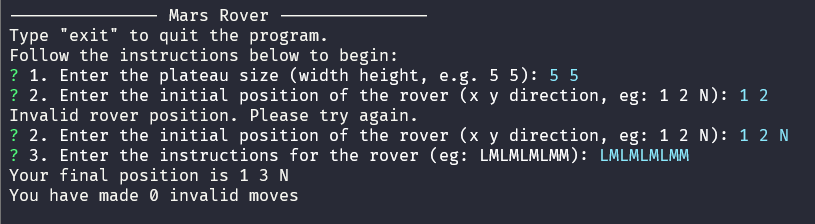

<p align="center">
  <h3 align="center">Mars Rover</h3>

  <p align="center">
    Mars Rover is a simple command-line program that simulates the movement of rovers on the surface of Mars. The program allows you to define the plateau size, initial positions of rovers, and provide instructions for their movement.
  </p>
</p>

<details open="open">
  <summary>Table of Contents</summary>
  <ol>
    <li>
      <a href="#problem">Problem</a>
      <ul>
        <li><a href="#problem-description">Problem description</a></li>
        <li><a href="#input">Input</a></li>
        <li><a href="#output">Output</a></li>
        <li><a href="#rover-data-example">Rover Data Example</a></li>
      </ul>
    </li>
    <li>
      <a href="#solution">Solution</a>
      <ul>
        <li><a href="#mars-rover">Technologies</a></li>
        <li><a href="#input">Architecture</a></li>
      </ul>
    </li>
    <li>
      <a href="#getting-started">Getting Started</a>
      <ul>
        <li><a href="#prerequisites">Prerequisites</a></li>
        <li><a href="#installation">Installation</a></li>
      </ul>
    </li>
    <li><a href="#usage">Usage</a></li>
    <li><a href="#testing">Testing</a></li>
  </ol>
</details>

## Problem

### Problem Description

A squad of robotic rovers are to be landed by NASA on a plateau on Mars.

This plateau, which is curiously rectangular, must be navigated by the rovers so that their onboard cameras can get a complete view of the surrounding terrain to send back to Earth.

A rover’s position and location are represented by a combination of x and y coordinates and a letter representing one of the four cardinal compass points. The plateau is divided up into a grid to simplify navigation. An example position might be 0, 0, N, which means the rover is in the bottom left corner and facing North.

In order to control a rover, NASA sends a simple string of letters. The possible letters are ‘L’, ‘R’ and ‘M’. ‘L’ and ‘R’ make the rover spin 90 degrees left or right respectively, without moving from its current spot. ‘M’ means move forward one grid point, and maintain the same heading.

Assume that the square directly North from (x, y) is (x, y 1).

### Input

The first line of input is the upper-right coordinates of the plateau, the lower-left coordinates are assumed to be 0,0.

The rest of the input is information pertaining to the rovers that have been deployed. Each rover has two lines of input. The first line gives the rover’s position, and the second line is a series of instructions telling the rover how to explore the plateau.

The position is made up of two integers and a letter separated by spaces, corresponding to the x and y co-ordinates and the rover’s orientation.

Each rover will be finished sequentially, which means that the second rover won’t start to move until the first one has finished moving.

### Output

The output for each rover should be its final co-ordinates and heading.

### Rover Data Example

#### Example 1

Landing Position: 1 2 N \
Instruction: LMLMLMLMM \
Final Position: 1 3 N

#### Example 2

Landing Position: 3 3 E \
Instruction: MRRMMRMRRM \
Final Position: 2 3 S

## Solution

### Technologies

- [Node.js](https://nodejs.org/en/) - JavaScript runtime environment
- [TypeScript](https://www.typescriptlang.org/) - JavaScript superset
- [Jest](https://jestjs.io/) - JavaScript testing framework
- [ESLint](https://eslint.org/) - JavaScript linter
- [Prettier](https://prettier.io/) - Code formatter
- [Inquirer.js](https://www.npmjs.com/package/inquirer) - Interactive command-line user interface

### Architecture

The Mars Rover project follows a modular and object-oriented architecture to provide a clean and organized structure for solving the problem. Here are the key architectural components:

- **Rover Class:** The `Rover` class represents a rover with attributes such as its position (x, y), direction (e.g., North, South, East, West), and movement instructions. It also has methods for executing instructions, rotating, and moving, as well as checking for collisions with other rovers.

- **Plateau Class:** The `Plateau` class is responsible for defining the size of the plateau and managing rover positions. It provides collision detection to prevent rovers from overlapping.

- **Input Modules:** Input modules (`PlateauInput`, `RoverPositionInput`, and `RoverInstructionsInput`) are used to capture user input via the command-line interface (CLI). They ensure that inputs are valid and meet the required format.

- **Testing Framework:** The project employs Jest, a popular JavaScript testing framework, for both unit and integration testing. This framework helps maintain code quality and verifies the correctness of the implemented logic.

- **Main Program:** The main program, located in `main.ts`, orchestrates the entire application. It initializes a plateau, accepts rover positions, verifies if collisions occur, executes rover instructions, and outputs the final positions.

This architecture allows for a modular and well-tested implementation of the Mars Rover problem, making it easier to understand, maintain, and extend.

## Getting Started

### Prerequisites

- Node.js
- NPM

### Installation

1. Clone the repo

   ```sh
   git clone https://github.com/alanneves/mars-rover.git
   ```

2. Install NPM packages
   ```sh
    npm install
   ```
3. Start the project
   ```sh
     npm start
   ```

## Usage

The program will prompt you to enter the size of the plateau. The format is `x y`, where `x` and `y` are integers greater than 0. For example, `5 5` will create a plateau with a width of 5 and a height of 5.

Next, you will be asked to enter the position of a rover. The format is `x y direction`, where `x` and `y` are integers, and `direction` is one of the following letters: `N`, `S`, `E`, `W`. For example, `1 2 N` will create a rover with a position of (1, 2) and facing North.

After entering the position of a rover, you will be asked to enter a series of instructions. The instructions are a string of letters, where `L` and `R` rotate the rover 90 degrees left and right, respectively, and `M` moves the rover forward one grid point. For example, `LMLMLMLMM` will rotate the rover 90 degrees left, move it forward one grid point, rotate it 90 degrees left, move it forward one grid point, and so on.

Then, you will see the final position of the rover after executing the instructions. The format is `x y direction`, where `x` and `y` are integers, and `direction` is one of the following letters: `N`, `S`, `E`, `W`. For example, `1 3 N` means that the rover is at position (1, 3) and facing North.

You can add more rovers by repeating the process. The program will check for collisions and prevent rovers from overlapping.

To exit the program, type "exit" or press Ctrl+C.

Example:



## Testing

To run the tests, run the following command:

```sh
npm test
```

